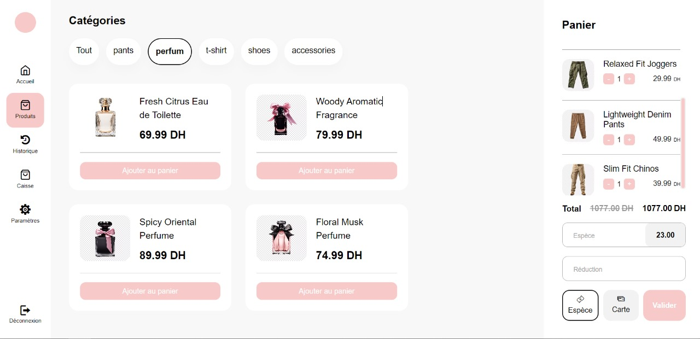

# PDO-System

## Project Overview
The PDO-System is a Point of Sale (POS) system designed to streamline sales processes and manage inventory efficiently. This project is built using React for the frontend.



## Features
- **Product Filtering**: Filter products based on categories or search terms.
- **Add to Cart**: Add products to the shopping cart and manage cart items.
- **Inventory Management**: Add, update, and delete products.
- **Sales Processing**: Handle transactions and generate receipts.
- **Reporting**: Generate sales and inventory reports.

## Installation
1. Clone the repository:
    ```bash
    git clone https://github.com/yourusername/PDO-System.git
    ```
2. Navigate to the project directory:
    ```bash
    cd PDO-System
    ```
3. Install dependencies:
    ```bash
    npm install
    ```

## Usage
1. Start the development server:
    ```bash
    npm start
    ```
2. Open your browser and navigate to `http://localhost:3000`.

## Contributing
Contributions are welcome! Please fork the repository and create a pull request with your changes.

## License
This project is licensed under the MIT License. See the [LICENSE](LICENSE) file for details.

## Contact
For any inquiries or support, please contact [your-email@example.com](mailto:your-email@example.com).

## Technologies Used
- **React**: A JavaScript library for building user interfaces.
- **Tailwind CSS**: A utility-first CSS framework for rapid UI development.

## Getting Started
1. Ensure you have Node.js and npm installed.
2. Install the project dependencies:
    ```bash
    npm install
    ```
3. Start the development server:
    ```bash
    npm start
    ```
4. Open your browser and navigate to `http://localhost:3000`.

## Folder Structure
- `src/`: Contains the source code of the React application.
- `public/`: Contains the static files.
- `config/`: Configuration files for the project.

## Available Scripts
In the project directory, you can run:

- `npm start`: Runs the app in the development mode.
- `npm test`: Launches the test runner in the interactive watch mode.
- `npm run build`: Builds the app for production to the `build` folder.

## React Hooks and Context

This project utilizes several React hooks and context for state management and side effects:

- **useState**: Manages local state within functional components.
- **useEffect**: Handles side effects such as data fetching and subscriptions.
- **useContext**: Provides a way to pass data through the component tree without having to pass props down manually at every level.
- **localStorage**: Used to persist state across sessions.

### Example Usage

#### useState
```javascript
import React, { useState } from 'react';

function ExampleComponent() {
    const [count, setCount] = useState(0);

    return (
        <div>
            <p>You clicked {count} times</p>
            <button onClick={() => setCount(count + 1)}>
                Click me
            </button>
        </div>
    );
}

##### useEffect
import React, { useState, useEffect } from 'react';

function ExampleComponent() {
    const [data, setData] = useState(null);

    useEffect(() => {
        fetch('https://api.example.com/data')
            .then(response => response.json())
            .then(data => setData(data));
    }, []);

    return (
        <div>
            {data ? <p>{data}</p> : <p>Loading...</p>}
        </div>
    );
}

###### useContext
import React, { useContext } from 'react';
import { MyContext } from './MyContextProvider';

function ExampleComponent() {
    const contextValue = useContext(MyContext);

    return (
        <div>
            <p>{contextValue}</p>
        </div>
    );
}
